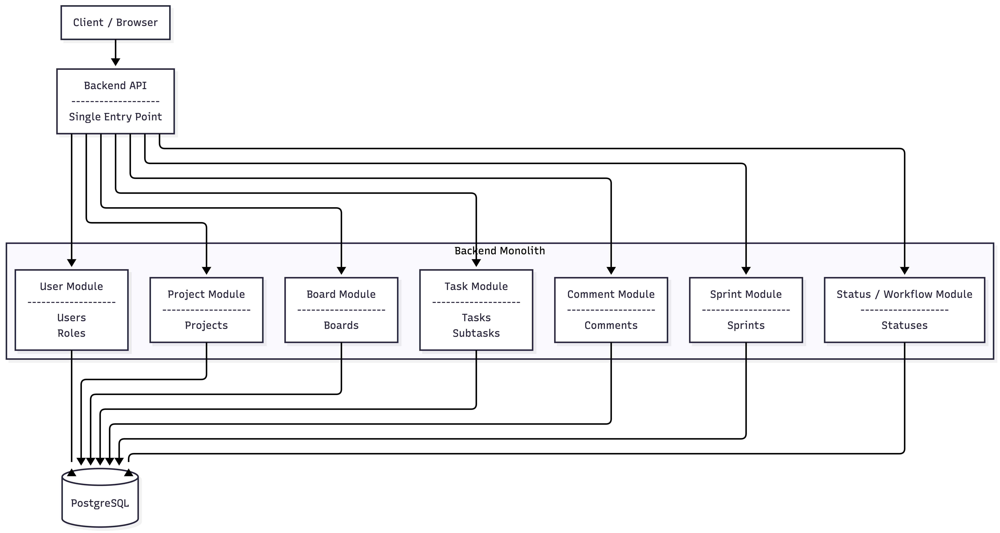

# back-miniJira

Backend-система для управления задачами в формате Jira-подобного трекера: поддерживает пользователей и роли, проекты и доски, спринты и статусы задач. Позволяет создавать задачи и подзадачи, добавлять комментарии, распределять работу по спринтам и отслеживать прогресс выполнения в рамках проектов.

---

## Мой вклад в проект

- Назначение и снятие пользователей с задач, контроль лимита исполнителей
- Строгая модель переходов статусов (todo ↔ in_progress ↔ done) без пропуска этапов
- Автоматическое управление временем выполнения (start_task, finish_task) в соответствии со статусом задач
- Изменение заголовка задачи (!/!!/!!!) в зависимости от приоритета
- Автообновление статуса проекта на основе состояния задач
- Все изменения выполняются транзакционно для сохранения целостности данных
- Настроил поиск, фильтрацию, сортировку и пагинацию списка задач
- Расширенное логирование

---

## Архитектура

Монолитный backend с модульным разделением доменов и общей базой данных.  
Чёткое разделение слоёв: API → сервисы → репозитории → БД.



---

## Стек


---


## Быстрый запуск

### Backend

```bash
# Клонировать репозиторий
git clone https://github.com/your-username/back-miniJira.git
cd back-miniJira

# Настроить окружение
cp .env.example .env

# Установить зависимости
go mod download

# (Опционально) заполнить БД тестовыми данными
make seede

# Запустить backend
make run
```

### Frontend

```bash
# Одной командой (запустить из корня репозитория)
bash -lc "set -e; echo 'Building backend...'; go mod download; mkdir -p bin; go build -o bin/back-miniJira ./...; echo 'Building frontend...'; cd frontend; (pnpm install || npm install || yarn install); cp .env.example .env 2>/dev/null || true; (pnpm build || npm run build || yarn build); echo 'Build finished'"
```

### Makefile — быстрые команды

```bash

#запустить backend
make run 
#заполнить БД тестовыми данными
make seed
#отформатировать код
make fmt
#статический анализ
make vet 
#обновить зависимости
make tidy 
#запустить golangci-lint
make lint 
#режим air
make dev 
```

---

## Обратная связь

Будем рады вопросам, предложениям и замечаниям по проекту.  
Обратную связь можно оставить через Issues или связаться с участниками команды напрямую.

---

## Команда проекта

## Команда проекта

[](https://github.com/IslamCHup)
[](https://github.com/warkaz16)
[](https://github.com/Sterling95)


